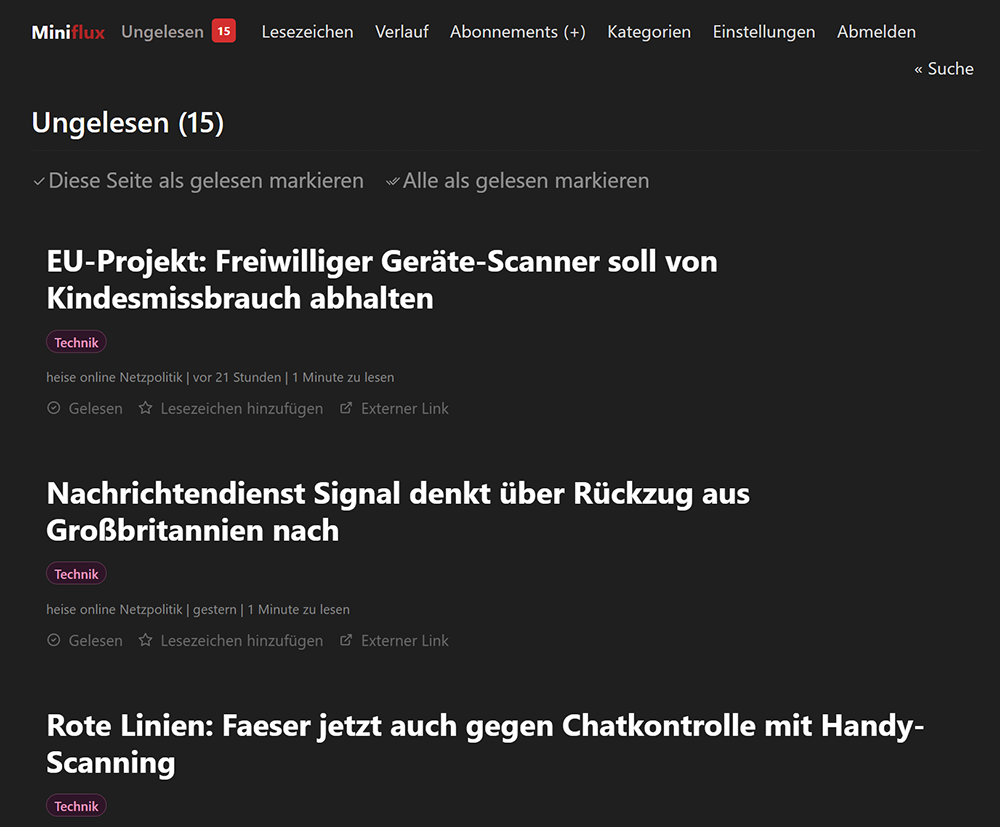
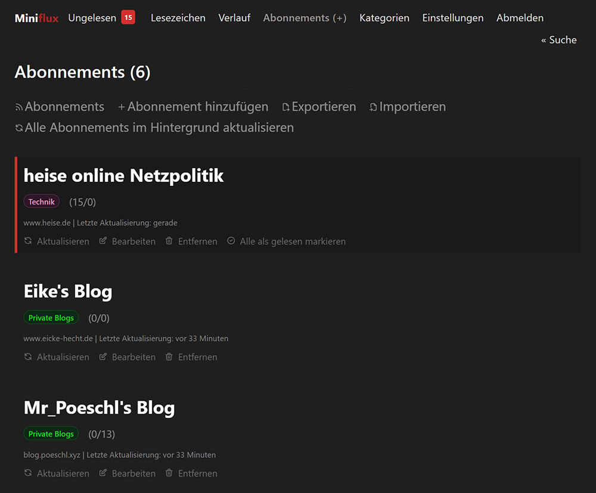
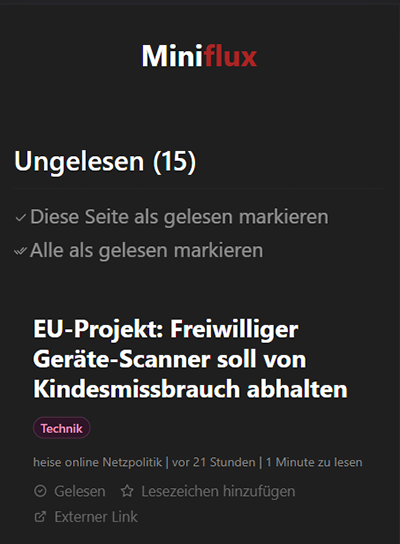
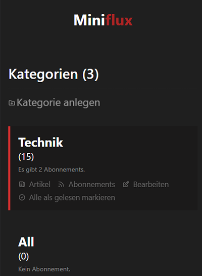

# Dark redisch midnight theme for Miniflux

A dark Miniflux theme that aims to be the most readable and modern minimal Miniflux theme out there.
Adjusted with a red touch and some personal adjustments.

## Screenshots

## How to use

1. Open [`https://poeschl.github.io/miniflux-theme-rednight/rednight-style.css`](https://poeschl.github.io/miniflux-theme-rednight/rednight-style.css)
2. Copy the whole file content
3. Go to **Settings > Custom CSS** and paste the contents there

## Development

1. Run `npm install`
2. Run `npm run build` to create the result `rednight-style.css` or watch for changes with `npm run dev`

## Thanks

Thanks to [@ronilaukkarinen](https://github.com/ronilaukkarinen) for the original theme.
